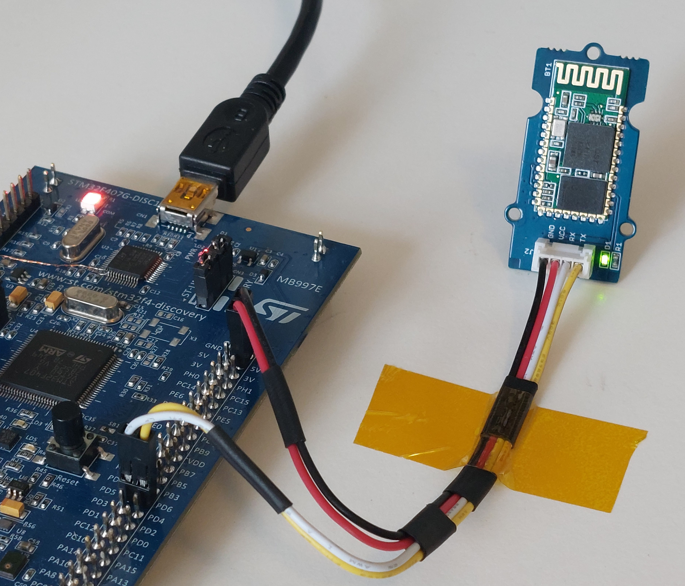

# FloatSat

Software templates for *FloatSat Praktikum* at *Julius-Maximilians-Universität Würzburg*.

## Table of contents

1. [Dependencies](#1-dependencies)
2. [Usage](#2-usage)
3. [Examples](#3-examples)
4. [Caution!](#4-caution)
    - [Virtual COM port configuration](#virtual-com-port-configuration)
	- [Links not working](#links-not-working)

## 1. Dependencies

1. GNU Arm Embedded Toolchain: ```gcc-arm-none-eabi```
	- Windows installer: https://developer.arm.com/downloads/-/gnu-rm
	- Linux installation command: ```apt install gcc-arm-none-eabi```
2. Open On-Chip Debugger: ```openocd```
	- Windows installer: https://gnutoolchains.com/arm-eabi/openocd/
	- Linux installation command: ```sudo apt-get install openocd```

### Note

1. For Windows, please add ```bin``` directory of both GNU Toolchain and OpenOCD to the PATH environment variable.
2. Make sure that the installation was successful simply by checking version using the commands ```arm-none-eabi-gcc --version``` and ```openocd --version```.

## 2. Usage

1. Select your operating system on Makefile by setting ```OS``` variable. Only Linux and Windows is supported as of now.
2. Clone (if not) and compile RODOS: ```make rodos```
3. Compile an example: ```make main=hello_blinky.cpp```
4. Compile and flash example: ```make flash main=hello_blinky.cpp```

## 3. Examples

### STM32 RODOS examples

Official RODOS repository contains a whole bunch of examples which can be found [here](rodos/tutorials/) after you clone RODOS. However, we have selected some basic examples to help you get started with RODOS for FloatSat.

1. [hello_blinky.cpp](hello_blinky.cpp) - Flashes four LEDs onboard the Discovery board.
3. [hello_world.cpp](hello_world.cpp) - Continuously prints ```Hello World!\n```  via UART port.
4. [hello_topic.cpp](hello_topic.cpp) - Inter-thread communication between two threads using a topic. Transmitter thread publishes the topic with increment of values every 5 seconds and the receiver thread subscribes to the topic once a second.

### Python middleware for RODOS

RODOS has [Python middleware ](rodos/support/support-programs/middleware-python) that allows communication between Python on computer and RODOS on STM32 using gateways such as UART (using bluetooth module) or UDP (using WiFi module). [This pdf](rodos/support/support-programs/middleware-python/readme.pdf) has instruction on how to install the middleware. There are some [examples](rodos/support/support-programs/middleware-python/examples/) on the RODOS repository, but again, we have included software to get started. It should be a good starting point to develop ground station.

1. [hello_python.cpp](hello_python.cpp) - Publishes data using RODOS topic via UART gateway (with bluetooth module) to Python. It also receives three axis sensor data from Python middleware and prints it on virtual COM port.
2. [python_rxtx.py](python_rxtx.py) - Receives topic published by RODOS and transmits the data by packing it into ```struct``` that is understood by RODOS.

<p align="center">
  
</p>

Figure: Setup to test communication with Python middleware. The middleware communicates with RODOS using bluetooth module connected to ```UART_IDX2``` (Tx: PD5 and Rx: PD6).

## 4. Caution!

### Virtual COM port configuration

In the Disovery boards provided in the lab, virtual COM ports has been enabled. This allows us to print messages using UART protocol via STLINK USB port onboard the STM32. PD8 and PD9 (UART3) pins are connected to the STLINK for the virtual COM.

However, RODOS configures UART2 by default. Therefore we should configure the appropriate UART port by uncommenting the corresponding ```UART_DEBUG``` in ```platform-parameter.h``` for the target device. For Discovery board, [this](rodos/src/bare-metal/stm32f4/platform-parameter/discovery/platform-parameter.h) is the file.

```C
#define UART_DEBUG UART_IDX3, GPIO_056, GPIO_057
```

Do not forget to recompile RODOS with ```make rodos``` after the configuration.

### Links not working

There are various links in this README that directs to files and folders inside the repository of RODOS. They will only work once you clone the repository using ```make rodos``` or simply ```git clone https://gitlab.com/rodos/rodos.git```.
